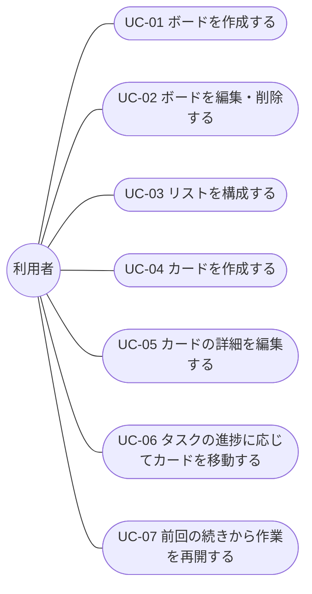
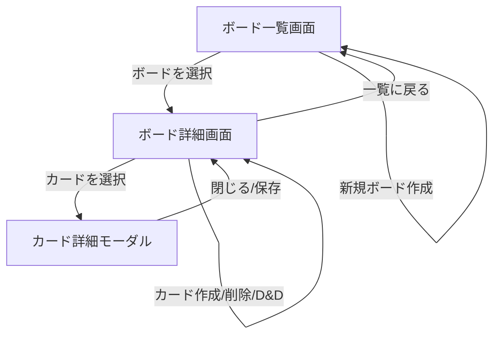
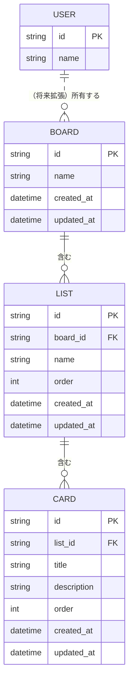

# TaskManagement 要件定義書

| 項目 | 内容 |
|---|---|
| 文書名 | TaskManagement 要件定義書 |
| バージョン | 1.0 |
| 作成日 | 2026-08-16 |
| 提出先 | 〇〇株式会社 御中 |
| 作成者 | 〇〇（受注者名） |

## 改訂履歴

| 版数 | 日付 | 変更内容 | 作成者 |
|---|---|---|---|
| 1.0 | 2026-08-16 | 初版作成 | 〇〇 |

## 承認欄

| 役割 | 会社名 | 氏名 | 承認日 |
|---|---|---|---|
| 発注者側承認者 | 〇〇株式会社 | | |
| 受注者側承認者 | 〇〇（自社名） | | |

---

## 目次

1. [はじめに](#1-はじめに)
2. [プロジェクト背景・目的](#2-プロジェクト背景目的)
3. [用語定義](#3-用語定義)
4. [システム概要](#4-システム概要)
5. [前提条件・制約条件](#5-前提条件制約条件)
6. [対象範囲（スコープ）](#6-対象範囲スコープ)
7. [想定ユーザー・利用シーン](#7-想定ユーザー利用シーン)
8. [ユースケース](#8-ユースケース)
9. [機能要件](#9-機能要件)
10. [非機能要件](#10-非機能要件)
11. [画面一覧・画面遷移](#11-画面一覧画面遷移)
12. [データ要件（ER図）](#12-データ要件er図)
13. [技術構成](#13-技術構成)
14. [概算スケジュール・体制](#14-概算スケジュール体制)
15. [リスクと対応方針](#15-リスクと対応方針)
16. [受け入れ基準・テスト方針](#16-受け入れ基準テスト方針)
17. [今後の拡張候補](#17-今後の拡張候補)

---

## 1. はじめに

本書は、TaskManagement（Trello風タスク管理Webアプリケーション、以下「本システム」）の開発にあたり、実現すべき機能・仕様・制約条件を明確化し、発注者・受注者双方の認識を合わせることを目的とした要件定義書である。

**想定読者**: 発注者側の担当者、および受注者側の開発担当者。

**関連文書**: 現時点で本書以外の関連文書（基本設計書・詳細設計書等）はなし。本書の内容をもとに、以降の工程で別途作成する。

## 2. プロジェクト背景・目的

タスクの担当・進捗状況が個人の頭の中やメモ帳に留まり、チーム内で可視化されていない、あるいは個人であってもタスクの全体像を俯瞰しづらいという課題は多くの現場で見られる。

こうした課題に対し、ボード・リスト・カードという3階層でタスクを視覚的に整理し、ドラッグ&ドロップで直感的に状態を更新できる、Trelloのようなカンバン方式のタスク管理ツールを導入することで、タスクの見える化と管理コストの削減を図る。

本プロジェクトでは、まず必要最小限の機能に絞った第一版を構築し、運用状況を踏まえて将来的な機能拡張（第17章参照）を検討する。

## 3. 用語定義

| 用語 | 定義 |
|---|---|
| ボード（Board） | プロジェクトやテーマ単位で作成する、タスク管理の最上位単位。複数のリストを含む |
| リスト（List） | ボード内に作成する列（カラム）。カードの状態（例：未着手／進行中／完了）を表す単位として利用する |
| カード（Card） | 個々のタスクを表す最小単位。タイトルと説明文を持ち、リストに属する |
| カンバン方式 | タスクを列（リスト）ごとに区分し、状態の変化に応じて視覚的に移動させて管理する手法 |
| ドラッグ&ドロップ（D&D） | マウス操作でカード・リストをつかんで移動させる操作方式 |
| API | フロントエンドとバックエンド間でデータをやり取りするためのインターフェース |
| アクター | ユースケースにおいて、本システムを操作する主体（本版では「利用者」の1種類のみ） |

## 4. システム概要

ボード・リスト・カードの3階層でタスクを管理し、ドラッグ&ドロップでカードやリストを移動できる、必要最小限の機能を備えたWebアプリケーションとする。データはフロントエンドからAPIサーバーを介してデータベースに保存し、ブラウザやデバイスを問わずアクセス時点の最新データを参照できる構成とする。

## 5. 前提条件・制約条件

| 項目 | 内容 |
|---|---|
| 想定ユーザー数 | 単一ユーザーでの利用を想定（ログイン・認証機能は本版では対象外） |
| データ保存先 | サーバーサイドのデータベース（DB）。ブラウザのLocalStorageには依存しない |
| 対応端末 | PCブラウザを想定（スマートフォン対応は対象外） |
| 予算・納期 | 別途協議のうえ決定する（本書時点では未確定） |
| 認証に関する制約 | 本版では認証機能を持たないため、本システムへアクセス可能な者は全員が同一データを閲覧・編集できる。公開ネットワーク上での運用にはアクセス制御（例：IP制限、簡易パスワード等）を別途検討する必要がある（第15章参照） |

## 6. 対象範囲（スコープ）

### 対象に含む

- ボード・リスト・カードのCRUD（作成・参照・更新・削除）
- カードのドラッグ&ドロップによるリスト間移動、リスト内並び替え
- リストのドラッグ&ドロップによる並び替え
- APIサーバーを介したデータベースへの永続化
- ブラウザ・端末を問わず、アクセス時点の最新データが参照できること

### 対象外（今後の拡張候補）

- ユーザー登録・ログイン・複数ユーザーでの共有（第17章参照）
- 複数ユーザーによる同時編集時の排他制御・競合解決
- カードへのラベル（色分け）、担当者アサイン、コメント、添付ファイル
- チェックリスト、通知、検索・フィルタ機能
- スマートフォン対応（レスポンシブデザイン）

## 7. 想定ユーザー・利用シーン

| ペルソナ | 特徴 | 利用シーン |
|---|---|---|
| 業務担当者 | 日々複数のタスクを抱え、進捗を自分自身で管理したい | 案件ごとにボードを作成し、タスクをリスト間で移動させながら進捗を管理する |
| チームリーダー（将来利用を想定） | チームのタスク状況を俯瞰したい | 現時点では単一ユーザー想定のため直接の対象外だが、第17章の拡張候補（複数ユーザー対応）の検討材料とする |

## 8. ユースケース

第7章のペルソナ・利用シーンをもとに、利用者が目的を達成するまでの操作の流れを代表的なユースケースとして整理する。各ユースケースは、第9章の機能要件（CRUD単位の詳細仕様）と対をなす、目的単位の操作フローである。

### ユースケース図

### UC-01 ボードを作成する

| 項目 | 内容 |
|---|---|
| アクター | 利用者 |
| 事前条件 | なし |
| 基本フロー | 1. ボード一覧画面を開く 2. 新規ボード作成を選択する 3. ボード名を入力し、作成を確定する 4. 新規ボードがDBに登録され、一覧に表示される |
| 代替・例外フロー | 3a. ボード名が未入力の場合、エラーを表示し作成しない |
| 事後条件 | 新規ボードが作成され、一覧に表示されている |
| 関連する機能要件 | F-01, F-02 |

### UC-02 ボードを編集・削除する

| 項目 | 内容 |
|---|---|
| アクター | 利用者 |
| 事前条件 | 対象のボードが存在する |
| 基本フロー | 1. ボード一覧からボードを選択する 2. ボード名の変更、またはボードの削除を選択する 3. 変更・削除操作を確定する 4. DB上の情報が更新（または削除）され、一覧に反映される |
| 代替・例外フロー | 2a. 削除を選択した場合、配下のリスト・カードも削除される旨を確認のうえ実行する |
| 事後条件 | ボード名の変更が反映されている、または対象ボードと配下のリスト・カードが削除されている |
| 関連する機能要件 | F-03, F-04 |

### UC-03 リストを構成する

| 項目 | 内容 |
|---|---|
| アクター | 利用者 |
| 事前条件 | 対象のボードが存在する |
| 基本フロー | 1. ボード詳細画面を開く 2. リストの作成、名称変更、削除、またはドラッグ&ドロップによる並び替えを行う 3. 変更内容がDBに反映される |
| 代替・例外フロー | 2a. リスト名が未入力の場合、エラーを表示し作成・変更しない 2b. リストを削除する場合、配下のカードも削除される旨を確認のうえ実行する |
| 事後条件 | リストの構成（内容・並び順）が最新の状態としてDBに保存され、画面に反映されている |
| 関連する機能要件 | F-05, F-06, F-07, F-08, F-09 |

### UC-04 カードを作成する

| 項目 | 内容 |
|---|---|
| アクター | 利用者 |
| 事前条件 | 対象のリストが存在する |
| 基本フロー | 1. ボード詳細画面で対象のリストを選択する 2. カードのタイトルを入力し、作成を確定する 3. 新規カードがDBに登録され、対象リストに表示される |
| 代替・例外フロー | 2a. タイトルが未入力の場合、エラーを表示し作成しない |
| 事後条件 | 新規カードが対象リストに作成されている |
| 関連する機能要件 | F-10, F-11 |

### UC-05 カードの詳細を編集する

| 項目 | 内容 |
|---|---|
| アクター | 利用者 |
| 事前条件 | 対象のカードが存在する |
| 基本フロー | 1. カードを選択し、カード詳細モーダルを開く 2. タイトル・説明文を編集する 3. 保存を確定する 4. DB上の情報が更新され、モーダルを閉じると一覧に反映されている |
| 代替・例外フロー | 3a. 保存せずにモーダルを閉じた場合、変更は破棄される |
| 事後条件 | カードの内容が最新の状態としてDBに保存されている |
| 関連する機能要件 | F-12 |

### UC-06 タスクの進捗に応じてカードを移動する

| 項目 | 内容 |
|---|---|
| アクター | 利用者 |
| 事前条件 | 対象のカードが存在する |
| 基本フロー | 1. ボード詳細画面でカードをドラッグする 2. 別のリスト、または同一リスト内の別の位置にドロップする 3. カードの所属リスト・表示順がDBに反映される |
| 代替・例外フロー | 2a. 保存前と同じ位置にドロップした場合、変更は発生しない |
| 事後条件 | カードの所属リスト・表示順が最新の状態としてDBに保存され、再読み込み後も維持されている |
| 関連する機能要件 | F-13, F-14, F-15, F-16 |

### UC-07 前回の続きから作業を再開する

| 項目 | 内容 |
|---|---|
| アクター | 利用者 |
| 事前条件 | 過去にボード・リスト・カードを作成済みである |
| 基本フロー | 1. 本システムに再度アクセスする（画面を開き直す、または再読み込みする） 2. API経由でDBから最新データを取得する 3. 前回終了時点の状態が画面に復元される |
| 代替・例外フロー | 2a. データ取得に失敗した場合、エラーを表示し再試行を促す |
| 事後条件 | 前回保存した状態のボード・リスト・カードが表示され、作業を継続できる |
| 関連する機能要件 | F-17 |

## 9. 機能要件

以下は、第8章のユースケースを実現するための機能をCRUD単位まで分解した一覧である。

### 9.1 ボード管理

| ID | 機能 | 内容 | 受け入れ基準 |
|---|---|---|---|
| F-01 | ボード一覧表示 | 作成済みのボードを一覧表示する | 画面表示時、DBに保存された全ボードが一覧に表示されること |
| F-02 | ボード作成 | ボード名を入力して新規ボードを作成する | ボード名を入力し作成操作を行うと、DBに新規ボードが登録され、一覧に反映されること |
| F-03 | ボード名編集 | 既存ボードの名前を変更する | 名前変更後、DB上の値が更新され、一覧・詳細画面に反映されること |
| F-04 | ボード削除 | ボードを削除する（配下のリスト・カードも削除される） | 削除操作後、対象ボードおよび配下のリスト・カードがDBから削除され、一覧に表示されなくなること |

### 9.2 リスト管理

| ID | 機能 | 内容 | 受け入れ基準 |
|---|---|---|---|
| F-05 | リスト表示 | ボード内のリストをカンバン形式（横並び）で表示する | ボード詳細画面を開くと、DBに保存された順序でリストが横並び表示されること |
| F-06 | リスト作成 | リスト名を入力して新規リストを作成する（例: 未着手/進行中/完了） | リスト名を入力し作成操作を行うと、DBに新規リストが登録され、画面に反映されること |
| F-07 | リスト名編集 | 既存リストの名前を変更する | 名前変更後、DB上の値が更新され、画面に反映されること |
| F-08 | リスト削除 | リストを削除する（配下のカードも削除される） | 削除操作後、対象リストおよび配下のカードがDBから削除され、画面に表示されなくなること |
| F-09 | リスト並び替え | ドラッグ&ドロップでリストの表示順を変更する | 並び替え操作後、新しい順序がDBに保存され、再読み込み後も順序が維持されること |

### 9.3 カード管理

| ID | 機能 | 内容 | 受け入れ基準 |
|---|---|---|---|
| F-10 | カード表示 | リスト内にカード（タイトル）を一覧表示する | リスト内に、DBに保存された順序でカードが表示されること |
| F-11 | カード作成 | リストにタイトルを入力して新規カードを作成する | タイトルを入力し作成操作を行うと、DBに新規カードが登録され、対象リストに表示されること |
| F-12 | カード詳細編集 | カードをクリックしてタイトル・説明文を編集する | 編集後、DB上の値が更新され、一覧・詳細に反映されること |
| F-13 | カード削除 | カードを削除する | 削除操作後、対象カードがDBから削除され、画面に表示されなくなること |
| F-14 | カード移動 | ドラッグ&ドロップでカードを別のリストへ移動する | 移動操作後、カードの所属リストがDBに反映され、再読み込み後も維持されること |
| F-15 | カード並び替え | ドラッグ&ドロップで同一リスト内のカード順を変更する | 並び替え操作後、新しい順序がDBに保存され、再読み込み後も順序が維持されること |

### 9.4 データ連携

| ID | 機能 | 内容 | 受け入れ基準 |
|---|---|---|---|
| F-16 | API経由保存 | ボード/リスト/カードへの変更をAPI経由でDBへ保存する | 各種変更操作の完了後、DB上のデータが即時に更新されていること |
| F-17 | データ取得・復元 | 画面表示・再読み込み時にAPI経由でDBから最新データを取得して表示する | ページ読み込み時、DBに保存された最新のボード/リスト/カード情報が表示されること |

## 10. 非機能要件

| カテゴリ | 内容 |
|---|---|
| 性能 | 個人利用規模（数ボード・数十〜百件程度のカード）において、画面操作・API応答にストレスがないこと（目安：主要操作の応答時間3秒以内） |
| 可用性 | 学習・検証用途のため高可用性は求めないが、通常利用時間帯にサーバーが継続稼働していること |
| セキュリティ | 認証機能を持たないため、機密性の高い情報の登録は想定しない。通信経路の暗号化（HTTPS）を可能な範囲で考慮する |
| ユーザビリティ | ドラッグ&ドロップ操作が直感的に行えること。主要操作についてマウス操作のみで完結すること |
| 保守性・拡張性 | 第17章に挙げる拡張候補（認証追加等）を見据え、機能追加が局所的な変更で対応できる構成とすること |
| 運用・監視 | 障害発生時にログ等から原因を確認できること（詳細な監視基盤の構築は本版では対象外） |
| データ整合性・バックアップ | DBのバックアップ方針は運用開始までに別途定める。本版ではバックアップの自動化は対象外とする |
| 互換性 | 主要モダンブラウザ（Chrome, Edge等）の最新版で動作すること |

## 11. 画面一覧・画面遷移

### 画面一覧

| 画面 | 内容 |
|---|---|
| ボード一覧画面 | 作成済みボードの一覧表示、新規ボード作成 |
| ボード詳細画面 | リスト・カードのカンバン表示、各種CRUD、ドラッグ&ドロップ操作 |
| カード詳細（モーダル） | カードのタイトル・説明文の編集 |

### 画面遷移図

## 12. データ要件（ER図）

本版のスコープにおけるデータモデルは以下の通り。ボード・リスト・カードは1対多の関係を持つ。ユーザー（User）は本版のスコープ外だが、将来の拡張（第17章）に備え、想定エンティティとして点線で示す。

### 主要テーブル概要

| テーブル | 主なカラム | 備考 |
|---|---|---|
| BOARD | id, name, created_at, updated_at | ボード情報 |
| LIST | id, board_id(FK), name, order, created_at, updated_at | order でリスト内表示順を管理 |
| CARD | id, list_id(FK), title, description, order, created_at, updated_at | order でカード内表示順を管理 |
| USER | id, name | 本版では未使用（将来の認証機能追加時に導入） |

## 13. 技術構成

| 項目 | 内容 |
|---|---|
| フロントエンド | React（想定） |
| バックエンド | APIサーバー（フレームワークは設計時に選定） |
| データベース | RDB（種類は設計時に選定） |
| ホスティング | 未定（フロントエンド・バックエンドの構成に応じて設計時に決定） |

## 14. 概算スケジュール・体制

### 概算スケジュール（例）

| 工程 | 期間（目安） |
|---|---|
| 要件確定 | 〇〇まで |
| 基本設計・詳細設計 | 〇〇まで |
| 実装 | 〇〇まで |
| テスト・受け入れ確認 | 〇〇まで |
| リリース | 〇〇 |

※ 実際の期間は、予算・体制確定後に別途協議のうえ確定する。

### 体制（例）

| 役割 | 担当 | 備考 |
|---|---|---|
| 発注者側窓口 | 〇〇株式会社 担当者 | 要件確認・受け入れ判定 |
| 受注者側責任者 | 〇〇 | 進行管理・品質責任 |
| 受注者側開発担当 | 〇〇 | 設計・実装・テスト |

## 15. リスクと対応方針

| リスク | 内容 | 対応方針 |
|---|---|---|
| 認証非対応によるデータ保護リスク | 認証機能がないため、アクセス可能な者は誰でもデータを閲覧・編集できる | 運用環境を限定する、またはアクセス制御を別途追加することを推奨として明記する |
| DB導入に伴う設計変更リスク | LocalStorageからDBへの方針転換により、想定より設計・実装工数が増える可能性がある | 詳細設計工程でスキーマ・API仕様を早期に確定し、手戻りを抑える |
| スコープ拡大リスク | 開発途中で第17章の拡張候補（認証・ラベル等）の要望が追加される可能性がある | 追加要望は本書のスコープ外として扱い、別途変更管理のうえ対応可否・工数を協議する |

## 16. 受け入れ基準・テスト方針

- 各機能要件（第9章）に定めた受け入れ基準を満たすことを、受注者による単体・結合テストで確認する
- 発注者は、本書第8章のユースケースおよび第9章の受け入れ基準に基づき、リリース前に受け入れテスト（UAT）を実施し、合否を判定する
- 非機能要件（第10章）については、可能な範囲で簡易的な確認（例：主要操作の応答時間の目視確認）を行う
- テストで指摘された不具合は、重要度に応じて修正のうえ再テストを行う

## 17. 今後の拡張候補

- ユーザー認証・複数ユーザー対応（ボードの共有、同時編集時の排他制御を含む）
- ラベル、期限日、担当者、チェックリスト、コメント機能
- 検索・フィルタ機能
- スマートフォン対応
- バックアップ・監視基盤の強化
