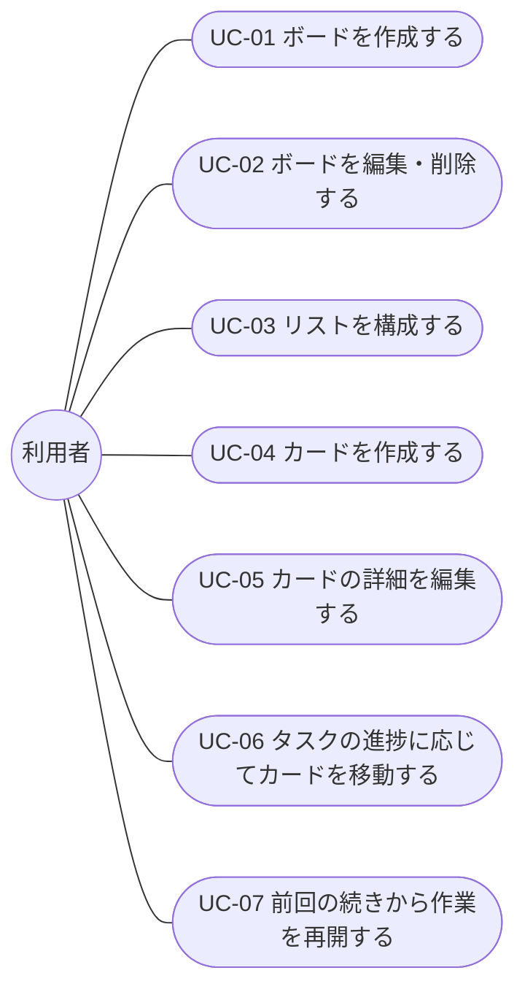

[← 要件定義書トップへ戻る](requirements.md)

# 業務要件書

## 1. 想定ユーザー・利用シーン

| ペルソナ | 特徴 | 利用シーン |
|---|---|---|
| 業務担当者 | 日々複数のタスクを抱え、進捗を自分自身で管理したい | 案件ごとにボードを作成し、タスクをリスト間で移動させながら進捗を管理する |
| チームリーダー（将来利用を想定） | チームのタスク状況を俯瞰したい | 現時点では単一ユーザー想定のため直接の対象外だが、[今後の拡張候補](requirements.md#17-今後の拡張候補)（複数ユーザー対応）の検討材料とする |

## 2. ユースケース

前節のペルソナ・利用シーンをもとに、利用者が目的を達成するまでの操作の流れを代表的なユースケースとして整理する。各ユースケースは、[機能要件書](functional.md)（CRUD単位の詳細仕様）と対をなす、目的単位の操作フローである。

### ユースケース図

### UC-01 ボードを作成する

| 項目 | 内容 |
|---|---|
| アクター | 利用者 |
| 事前条件 | なし |
| 基本フロー | 1. ボード一覧画面を開く 2. 新規ボード作成を選択する 3. ボード名を入力し、作成を確定する 4. 新規ボードがDBに登録され、一覧に表示される |
| 代替・例外フロー | 3a. ボード名が未入力の場合、エラーを表示し作成しない |
| 事後条件 | 新規ボードが作成され、一覧に表示されている |
| 関連する機能要件 | [F-01](functional.md#f-01), [F-02](functional.md#f-02) |

### UC-02 ボードを編集・削除する

| 項目 | 内容 |
|---|---|
| アクター | 利用者 |
| 事前条件 | 対象のボードが存在する |
| 基本フロー | 1. ボード一覧からボードを選択する 2. ボード名の変更、またはボードの削除を選択する 3. 変更・削除操作を確定する 4. DB上の情報が更新（または削除）され、一覧に反映される |
| 代替・例外フロー | 2a. 削除を選択した場合、配下のリスト・カードも削除される旨を確認のうえ実行する |
| 事後条件 | ボード名の変更が反映されている、または対象ボードと配下のリスト・カードが削除されている |
| 関連する機能要件 | [F-03](functional.md#f-03), [F-04](functional.md#f-04) |

### UC-03 リストを構成する

| 項目 | 内容 |
|---|---|
| アクター | 利用者 |
| 事前条件 | 対象のボードが存在する |
| 基本フロー | 1. ボード詳細画面を開く 2. リストの作成、名称変更、削除、またはドラッグ&ドロップによる並び替えを行う 3. 変更内容がDBに反映される |
| 代替・例外フロー | 2a. リスト名が未入力の場合、エラーを表示し作成・変更しない 2b. リストを削除する場合、配下のカードも削除される旨を確認のうえ実行する |
| 事後条件 | リストの構成（内容・並び順）が最新の状態としてDBに保存され、画面に反映されている |
| 関連する機能要件 | [F-05](functional.md#f-05), [F-06](functional.md#f-06), [F-07](functional.md#f-07), [F-08](functional.md#f-08), [F-09](functional.md#f-09) |

### UC-04 カードを作成する

| 項目 | 内容 |
|---|---|
| アクター | 利用者 |
| 事前条件 | 対象のリストが存在する |
| 基本フロー | 1. ボード詳細画面で対象のリストを選択する 2. カードのタイトルを入力し、作成を確定する 3. 新規カードがDBに登録され、対象リストに表示される |
| 代替・例外フロー | 2a. タイトルが未入力の場合、エラーを表示し作成しない |
| 事後条件 | 新規カードが対象リストに作成されている |
| 関連する機能要件 | [F-10](functional.md#f-10), [F-11](functional.md#f-11) |

### UC-05 カードの詳細を編集する

| 項目 | 内容 |
|---|---|
| アクター | 利用者 |
| 事前条件 | 対象のカードが存在する |
| 基本フロー | 1. カードを選択し、カード詳細モーダルを開く 2. タイトル・説明文を編集する 3. 保存を確定する 4. DB上の情報が更新され、モーダルを閉じると一覧に反映されている |
| 代替・例外フロー | 3a. 保存せずにモーダルを閉じた場合、変更は破棄される |
| 事後条件 | カードの内容が最新の状態としてDBに保存されている |
| 関連する機能要件 | [F-12](functional.md#f-12) |

### UC-06 タスクの進捗に応じてカードを移動する

| 項目 | 内容 |
|---|---|
| アクター | 利用者 |
| 事前条件 | 対象のカードが存在する |
| 基本フロー | 1. ボード詳細画面でカードをドラッグする 2. 別のリスト、または同一リスト内の別の位置にドロップする 3. カードの所属リスト・表示順がDBに反映される |
| 代替・例外フロー | 2a. 保存前と同じ位置にドロップした場合、変更は発生しない |
| 事後条件 | カードの所属リスト・表示順が最新の状態としてDBに保存され、再読み込み後も維持されている |
| 関連する機能要件 | [F-13](functional.md#f-13), [F-14](functional.md#f-14), [F-15](functional.md#f-15), [F-16](functional.md#f-16) |

### UC-07 前回の続きから作業を再開する

| 項目 | 内容 |
|---|---|
| アクター | 利用者 |
| 事前条件 | 過去にボード・リスト・カードを作成済みである |
| 基本フロー | 1. 本システムに再度アクセスする（画面を開き直す、または再読み込みする） 2. API経由でDBから最新データを取得する 3. 前回終了時点の状態が画面に復元される |
| 代替・例外フロー | 2a. データ取得に失敗した場合、エラーを表示し再試行を促す |
| 事後条件 | 前回保存した状態のボード・リスト・カードが表示され、作業を継続できる |
| 関連する機能要件 | [F-17](functional.md#f-17) |

---

[← 要件定義書トップへ戻る](requirements.md)
