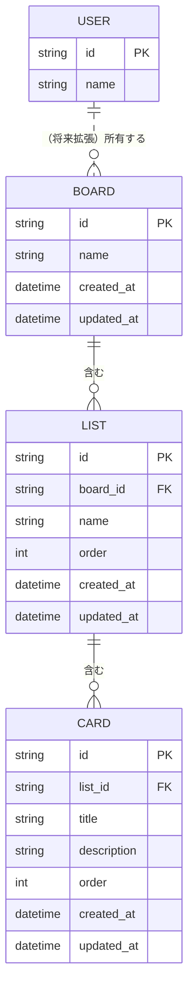

[← 要件定義書トップへ戻る](requirements.md)

# データ要件書

## 1. ER図

本版のスコープにおけるデータモデルは以下の通り。ボード・リスト・カードは1対多の関係を持つ。ユーザー（User）は本版のスコープ外だが、将来の拡張（[今後の拡張候補](requirements.md#17-今後の拡張候補)）に備え、想定エンティティとして点線で示す。

## 2. 主要テーブル概要

| テーブル | 主なカラム | 備考 |
|---|---|---|
| BOARD | id, name, created_at, updated_at | ボード情報 |
| LIST | id, board_id(FK), name, order, created_at, updated_at | order でリスト内表示順を管理 |
| CARD | id, list_id(FK), title, description, order, created_at, updated_at | order でカード内表示順を管理 |
| USER | id, name | 本版では未使用（将来の認証機能追加時に導入） |

---

[← 要件定義書トップへ戻る](requirements.md)
