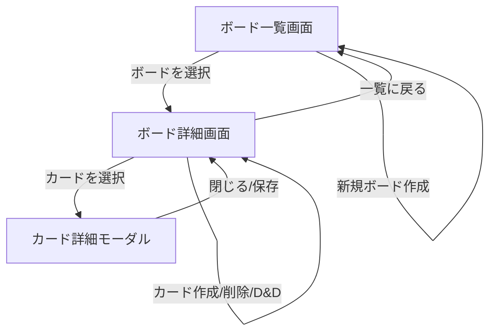

[← 要件定義書トップへ戻る](requirements.md)

# 画面要件書

## 1. 画面一覧

| 画面 | 内容 |
|---|---|
| ボード一覧画面 | 作成済みボードの一覧表示、新規ボード作成 |
| ボード詳細画面 | リスト・カードのカンバン表示、各種CRUD、ドラッグ&ドロップ操作 |
| カード詳細（モーダル） | カードのタイトル・説明文の編集 |

## 2. 画面遷移図

---

[← 要件定義書トップへ戻る](requirements.md)
